# Languages

- en [English](QuickStart.md)
- zh_CN [简体中文](QuickStart.zh_CN.md)

# PyCFF - Quick Start

## 1. Input

Perform data input operations in the `Input` tag.

 - The program initially displays a 2×5 sized data. In addition to entering data through the input bar at the top, you can also enter data by double-clicking the cell.
   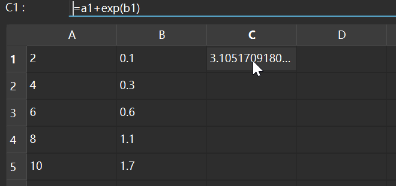
 - The table supports formula input, indexing data in other cells through methods similar to Excel labels such as "A1" and "B2", and supports simple function operations.
 - You can expand the formula quickly to other cells through the right-click menu to avoid the inefficiency caused by repeated manual entry.
   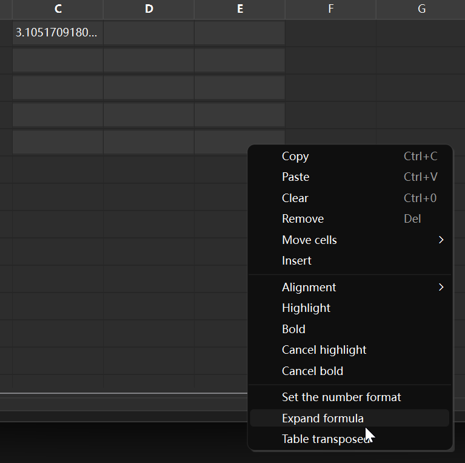
   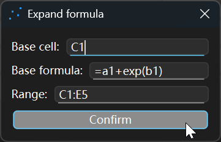
   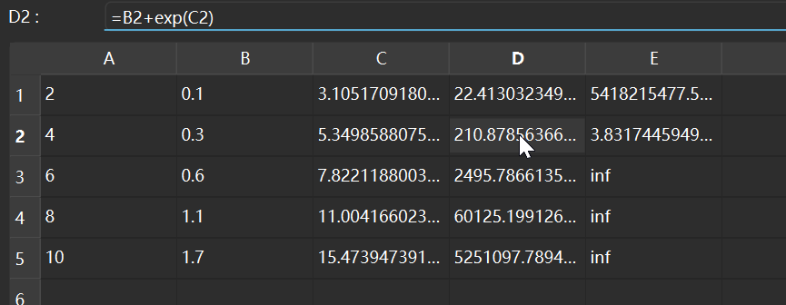
 - You can copy and paste Excel spreadsheets to access data, or load and save data by reading and writing files (Supports .csv, .xls, and .xlsx formats).
 - YYou can use the right-click menu to operate cells, such as copying, pasting, deleting, inserting rows/columns, etc.
   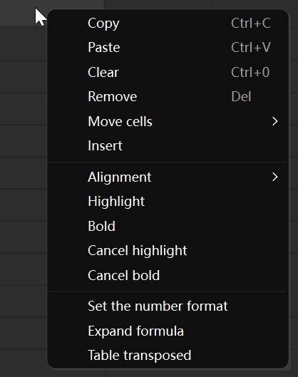
 - You can use the "Paste Replace Column" option on the right-click menu to quickly load data from the clipboard into a specified column. The data is automatically split by non-numeric characters, making it easy to quickly read large amounts of data.
   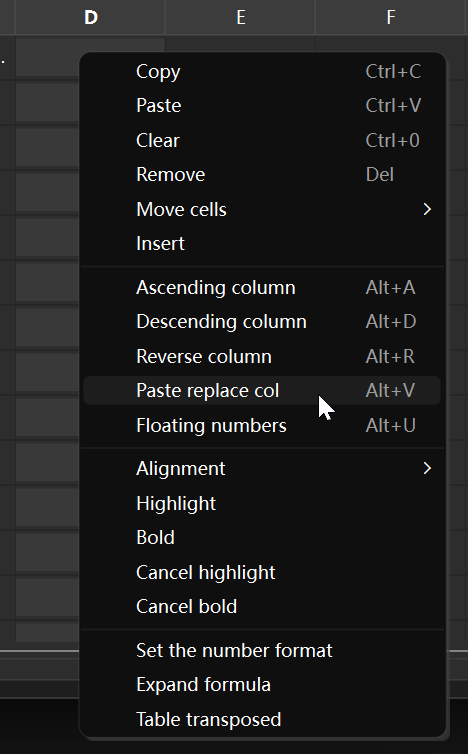
 - After entering the data, select the data columns corresponding to the independent variable (x) and dependent variable (y) using the checkboxes on the right. It is recommended to click the `Refresh` button to ensure that the table data is loaded.

## 2. Plot

Perform simple plotting operations in the Plot tab.

 - The initial plot displays the scatter plot data (red solid lines) and the fitted curve (black smooth dashed line) from the previous 2×5 table.
 - Click the Refresh button in this tab to draw the scatter plot using the input data.
 - You can customize the plot title, axis labels, and number format, as well as curve labels, colors, line types, and thickness.
   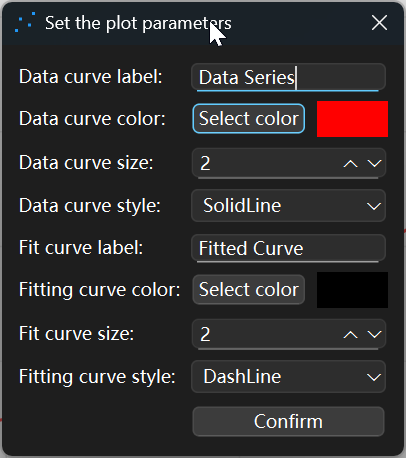
 - You can save plots, currently supporting SVG and PNG formats.
 - Supports copying plot view to the clipboard for quick pasting into reports. Supports copying plot view in SVG and PNG formats.
   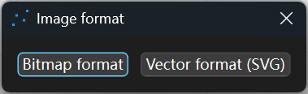
 - Supports adjusting the plot size to match the requirements of the report file.
   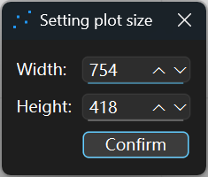

## 3. Output

Perform function fitting in the "Output" tab.

 - Select the function type from the checkbox at the top left: a predefined function or a custom function.
   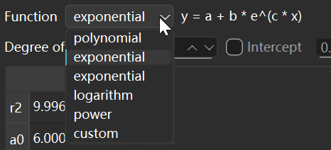
 - Supports custom functions, automatically extracts function parameters, and calculates function parameters through nonlinear prediction.
   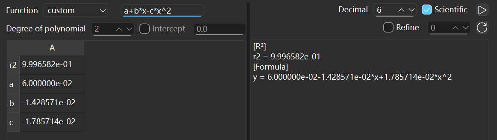
 - Click the "Calculate" button at the top right. The calculated function parameters and R2 value will be displayed in the table on the left, and the complete function expression will be displayed in the text box on the right.
 - You can customize the numeric format of the displayed parameters using the checkbox at the top right.
 - After calculating the function parameters, click the "Refresh" button to plot a scatter plot and function curve in the "Plot" tab. You can customize the level of detail of the function curve.
 - In the two sets of input boxes at the bottom, you can calculate the Y value of the function by entering an X value, or predict the X value given a Y value for data prediction.
   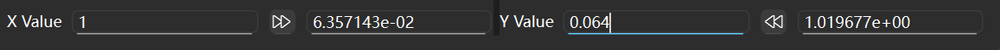

## 4. Others

The function of adjusting themes and colors has been added. If you don’t like matching the system default theme and color, you can use this function to choose your favorite color.
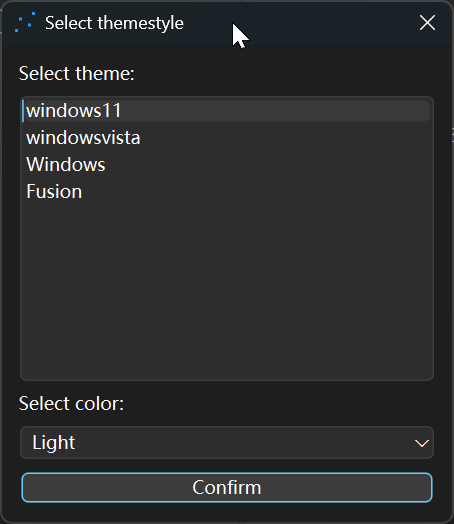

If you like this software, please don't hesitate to give it a star, and please visit the [homepage](https://github.com/AndrewMoa2005/PyCFF) for more information.
